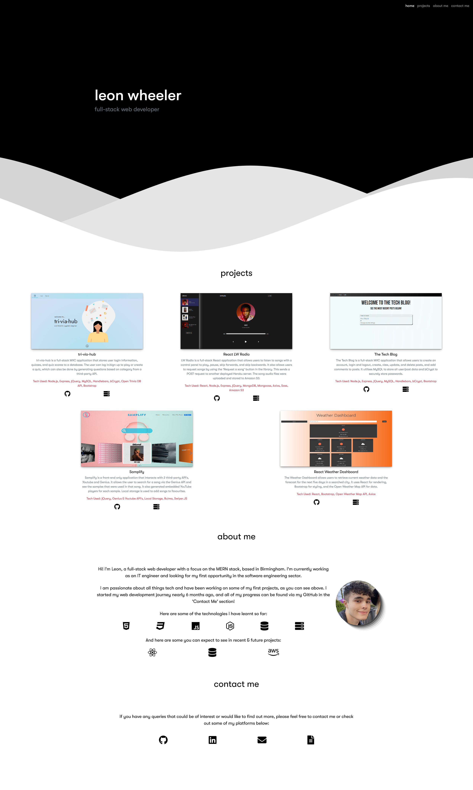

# React Portfolio

## Description

My most recent portfolio that was built using React, showcasing some of my projects built within the last 6 months using a wide range of technologies.

Deployed application link: [Portfolio](https://leonwheeler.netlify.app/)

## Table of Contents

- [React Portfolio](#react-portfolio)
  - [Description](#description)
  - [Table of Contents](#table-of-contents)
  - [Installation](#installation)
  - [Usage](#usage)
  - [Screenshots](#screenshots)
  - [Tech/framework used](#techframework-used)
  - [Scripts](#scripts)
  - [Tests](#tests)
  - [Contact](#contact)

## Installation

```
npm install
```

## Usage

Click the deployed link above and check out some of my most recent projects!

## Screenshots

Homepage:


## Tech/framework used

<b>Built with</b>

- [React](https://reactjs.org//)
- [Sass](https://sass-lang.com/)
- [Bootstrap](https://getbootstrap.com/)

## Scripts

You can use the below scripts to run the app:

```
npm run start
```

## Tests

N/A

## Contact

For any issues, please contact [my email](mailto:leonwheeler08@gmail.com) 😀
